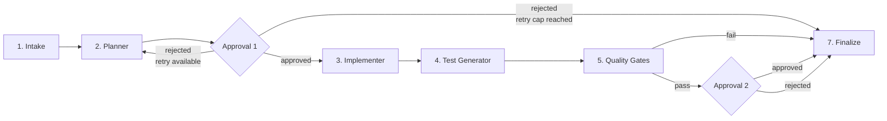
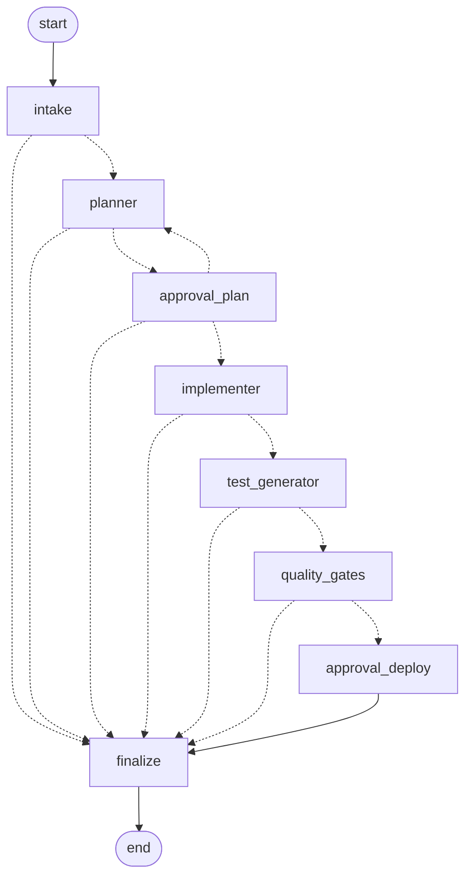

# Architecture

This document explains the **why** behind the codebase — the key design
decisions, the trade-offs they involved, the limitations a reviewer
should be aware of, and what I would do next given more time.

---

## 1. High-level flow



Every node is a Python function that accepts and returns a
[`PipelineRun`](../pipeline/state.py) Pydantic model. Halt detection is a
single boolean (`PipelineRun.halted`) checked by a conditional-edge
router after every stage; on halt the graph fast-forwards to `finalize`
so the audit log and metrics are always written.

**Re-plan loop.** Rejection at Approval 1 does *not* halt the run. The
reviewer's note is captured into `PipelineRun.rejection_feedback`, the
edge routes back to the planner, and the next planner attempt sees the
prior feedback injected into its prompt (planner template `v2`). After
`run.max_replans` rejections (default 3) the run halts cleanly to
`finalize`. Rejection at Approval 2 still halts directly — at that
point code and tests have already passed all four quality gates, so
"no" means "discard the run" rather than "try again".

---

## 2. The compiled LangGraph

Orchestration uses LangGraph's `StateGraph`. The graph is built in
[`pipeline/graph.py`](../pipeline/graph.py) and rendered to mermaid at
the end of every run (`audit_logs/<run_id>/graph.mmd`). This is the
real, runtime-generated graph:



Solid arrows are unconditional edges; dotted arrows are conditional
edges resolved at runtime.

Two routers are at work:

- **`cont_or_halt(next)`** — used by intake, planner, implementer,
  test_generator and quality_gates. Returns `"finalize"` if
  `run.halted is True`, else `next`.
- **`_route_after_approval_plan`** — used by approval_plan only.
  Returns `"finalize"` if halted (incl. retry-cap exhaustion),
  `"planner"` if the last approval was rejected and we still have
  retries, else `"implementer"`. This is the edge that creates the
  re-plan loop.

---

## 3. Design decisions

### 3.1 LangGraph over a hand-rolled orchestrator

The assessment lists "agent orchestration" as an encouraged optional
feature, and conditional edges (halt vs. continue, approved vs.
rejected) map cleanly onto a DAG framework. LangGraph also gives us a
mermaid export for free, which becomes part of the audit trail.

The cost is one extra dependency and a small amount of indirection. I
kept the stage functions plain Python so swapping orchestrators
(Temporal, Prefect, raw asyncio) would be a local change.

### 3.2 Pydantic v2 for all state

Every object that flows between stages — `FeatureSpec`, `Plan`,
`GeneratedFile`, `GateResult`, `AuditEvent`, `PipelineRun` — is a
Pydantic v2 model. This buys:

1. **Free intake validation.** YAML/JSON/MD parsers dump to dicts, then
   `FeatureSpec.model_validate(...)` produces precise errors listing
   exactly which fields are missing or malformed.
2. **JSON round-trip out of the box.** Audit events serialise with
   `model_dump_json()`; LLM-returned plans are validated the same way as
   the input spec.
3. **End-to-end mypy coverage** because the state is typed.

### 3.3 Append-only JSONL audit log

`audit_logs/<run_id>/audit.jsonl` is the **single source of truth** for
a run. Everything else in the directory (`plan.json`, `prompts/...`,
`responses/...`, `gates/*.log`, `summary.md`, `graph.mmd`) is a
human-friendly derivative.

JSONL was chosen over SQLite or a structured log shipper because:

- It is `tail -f`-able during a run — operators get live observability
  for free.
- It is append-only and crash-safe.
- It is trivially diffable across runs and trivially ingestible by any
  log backend later (Datadog, BigQuery, Loki, OpenSearch).

### 3.4 Hard-coded sandbox roots + path validation

Generated code is the most dangerous thing the pipeline does. The
[`sandbox.guard`](../pipeline/sandbox.py) function rejects:

- absolute POSIX paths,
- Windows drive-letter paths (`C:/...`),
- any `..` traversal segment,
- home-relative paths (`~/...`),
- anything that resolves outside the explicitly-passed `allowed_root`.

Implementer's allowed root is `src/`; Test Generator's is `tests/` (and
it refuses to overwrite the hand-written `pipeline_*` test files). All
six guard behaviours are unit-tested in
[`tests/pipeline_sandbox_test.py`](../tests/pipeline_sandbox_test.py).

### 3.5 Structured JSON prompts with one retry

All three LLM calls (planner, implementer, test generator) instruct the
model to return a single JSON object. The
[`llm.call_json`](../pipeline/llm.py) helper:

- Tolerates the model wrapping the JSON in a ```` ```json ```` fence.
- If the first response is not parseable, retries **once** with an
  appended "your last response was not valid JSON, return ONLY JSON"
  instruction.
- Bubbles a clean `LLMError` on a second failure.

Simplest reliability layer that meaningfully reduces flakes without
growing the prompt every call.

### 3.6 Provider-agnostic LLM layer

The same `call_json` / `call_text` API talks to three back-ends,
selected by the `LLM_PROVIDER` environment variable:

| Provider | How it's reached | When to use |
| --- | --- | --- |
| `ollama` | `POST {base_url}/chat/completions` via `httpx` | Local, free, default. |
| `openai` | Same wire format as ollama | OpenAI or any OpenAI-compatible vendor (Groq, Together, vLLM, LM Studio, …). |
| `anthropic` | Official `anthropic` SDK | Claude models. |

I standardised on the OpenAI Chat Completions wire format because Ollama
exposes it natively and every commercial inference vendor speaks it.
The Anthropic SDK path is retained because Claude's native message
format is slightly more efficient and the models follow JSON schemas
more reliably.

Provider choice is purely deployment configuration — it doesn't change
the prompts, the schema, or the validation logic. The `LLMUsage` record
carries the provider id back into the audit log so a reviewer can tell
exactly which model produced any past output.

### 3.7 Versioned prompt registry

Every prompt lives in a versioned file (`planner.v1.md`,
`implementer.v1.md`, …) under
[`pipeline/prompts/`](../pipeline/prompts/). The
[`registry`](../pipeline/prompts/registry.py) loads the latest `vN` file
for a name, hashes its contents (sha256, first 8 hex chars), and returns
a `(template, version_id="v1+a1b2c3d4")` pair. The version id is
stamped into every audit event, so any past run is exactly
reproducible. Bumping the version is as simple as dropping a
`planner.v2.md` next to `v1`.

### 3.8 Quality gates as subprocesses

`ruff`, `mypy`, `pytest`, and `bandit` run as `subprocess.run` calls
with `shell=False` and a fixed argument list. We resolve the executable
via `shutil.which`, falling back to `python -m <tool>` so the pipeline
works in environments where the venv's `Scripts/bin` directory isn't on
`PATH`. Each gate's full stdout/stderr is captured into
`audit_logs/<run_id>/gates/<gate>.log`.

I deliberately keep **all four** gates running even after one fails, so
the audit captures every gate's verdict for the same code revision.
Halt-on-failure is enforced after the loop, not inside it.

### 3.9 AC coverage via grep

Test files are required to contain a `Covers: AC-<n>` docstring tag for
each acceptance criterion. The [`metrics`](../pipeline/metrics.py)
module greps for that tag set and reports `covered / total`.
Intentionally low-tech — works for any framework, doesn't need AST
analysis, and gives the model a single concrete obligation it can
satisfy.

### 3.10 One approval mechanism, two checkpoints, one re-plan loop

`pre-implementation` and `pre-deploy` both go through
[`approval.request`](../pipeline/approval.py). Interactive mode uses
Rich's `Confirm`; CI mode (`--auto-approve` or
`PIPELINE_AUTO_APPROVE=1`) auto-records an "approved" decision
attributed to the configured actor (`PIPELINE_ACTOR`, defaulting to the
OS user). Either way the decision becomes both an `AuditEvent` and an
`Approval` record on the run state.

**Pre-implementation rejection re-plans.** Saying "no" at Approval 1 is
treated as a request to iterate, not abort:

1. The CLI prompts the reviewer for an optional reason (stored as
   `Approval.note`).
2. The note is appended to `PipelineRun.rejection_feedback` as a typed
   [`RejectionFeedback`](../pipeline/state.py) record.
3. The router edge from `approval_plan` routes back to `planner`.
4. The next planner attempt renders prompt `planner.v2`, which always
   contains a `{rejection_feedback}` slot. When non-empty, that slot
   instructs the model to address the reviewer's concerns.
5. Prior prompts/responses on disk are preserved via an `.attempt-N`
   filename suffix; the audit log carries `attempt` and
   `had_rejection_feedback` in every planner `stage.passed` event.
6. After `run.max_replans` rejections (default 3) the run halts cleanly
   to `finalize`. At temperature 0 the model would otherwise re-emit
   the same plan and the loop would spin until a human intervened.

Pre-deploy rejection still halts directly. At that point the four
quality gates have already passed, so "no" means "discard this run",
not "try again".

---

## 4. Trade-offs

| Decision | Trade-off |
| --- | --- |
| LLM as the planner | Plans are non-deterministic. Mitigated with `temperature=0`, a strict JSON schema in the prompt, parse-retry, and Pydantic validation. A rule-based planner would be more predictable but couldn't adapt to arbitrary specs. |
| Python-only target | The whole pipeline assumes generated code is Python. Multi-language support needs per-language gate runners and prompt variants; out of scope for the timebox, but the abstractions make it a non-invasive change. |
| Filesystem-only sandbox | We restrict file writes but generated code still runs unrestricted under `pytest`. Production would run gates in a container or seccomp sandbox. The `Dockerfile` is the obvious first step. |
| CLI approvals | Lightweight and demonstrable, but not a real review UX. A team would want PR-style review with diffs, comments, and signed audit. |
| Three LLM providers, wildly different quality | Local models via Ollama (default `qwen2.5-coder:1.5b`, ~986MB) keep the dev loop free and offline but produce shakier JSON than paid models; OpenAI / Anthropic are pay-per-use but reliable. The provider abstraction means swapping is one env-var change, so teams can iterate prompts locally and promote to a paid model in CI. |
| `tail -f` of `audit.jsonl` as the dashboard | Implemented and zero-infra. A real Grafana / Streamlit dashboard would be friendlier; explicitly out of scope. |

---

## 5. Limitations

- **No incremental re-runs.** Every run starts from scratch. If
  Implementer succeeds and Test Generator fails, we re-do the
  Implementer next time. A `--resume` mode would need to hydrate
  `PipelineRun` from `audit.jsonl`.
- **No memory of prior runs.** The planner sees the spec only — it
  cannot learn from previous designs of the same feature.
- **Cost is estimated, not enforced.** USD per call is logged from a
  static price table, but there's no per-run budget guardrail.
- **Generated tests share a `pytest` invocation with the hand-written
  `pipeline_*` tests.** Fine for an assessment; production would want
  separate processes / cwds.
- **Mermaid PNG rendering is best-effort.** `graph.mmd` is always
  written; PNG generation depends on optional LangGraph native deps and
  is not allowed to fail the run.

---

## 6. Future improvements

If I had another day or two:

1. **Resumable runs** — hydrate `PipelineRun` from `audit.jsonl` and
   support `--resume <run_id> --from <stage>`. Highest-DX-value change.
2. **Budget guardrails** — `--max-cost-usd` / `--max-tokens` flags that
   short-circuit the pipeline with a clean halt and a logged reason.
3. **OpenTelemetry export** — one OTel span per stage, the LLM call as
   a child span with token counts as attributes; wire to Honeycomb /
   Tempo in CI.
4. **Plan diff at the approval checkpoint** — when re-planning, show a
   coloured diff against the previously-approved plan so the reviewer
   focuses on what changed.
5. **Multi-language support** — the planner already returns
   `impacted_files`; add a language router that picks gate sets and
   prompt variants per language (ruff/mypy → eslint/tsc for TS,
   golangci-lint for Go, …).
6. **Web approval UI** — a 1-page FastAPI/Streamlit app showing the
   plan, diff, and gate output with approve/reject + comments.
   Decisions still flow through the existing `approval` module, so audit
   semantics don't change.
7. **Spec versioning + run history** — hash the input spec into the
   audit log; build a `pipeline log` command that shows the run history
   for a given spec.
8. **Vector-backed retrieval of prior runs** — give the planner
   summaries of the last N successful runs for the same feature name so
   it can iterate rather than re-design.
